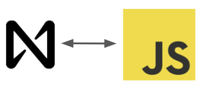

# ConnectIoT API
Specific implementation for the ConnectIoT project based on the official NEAR REST API SERVER repository.
With this API methods in the ConnectIoT Smart Contract can be called.

If you want to learn more watch this [video]() and go to the [ConnectIoT-API repository](https://github.com/paul-cruz/ConnectIoT-API)

