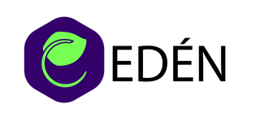
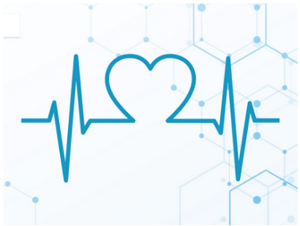

# Use cases

### Mexbalia is always at the forefront of research and development. During the Covid-19 pandemic, we developed a [Pulse-Oximeter](https://mexbalia.com/oximeter/) that records data in the Google cloud and before that, we created an educational project for plant monitoring and growth, called [Eden](https://mexbalia.com/eden/).

### Mexbalia wants to take these projects to the next step and combine them with the ConnectIoT platform as a use of case example. 

***Click in the logos to see some examples***

